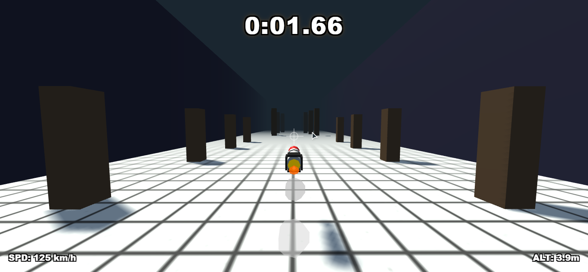
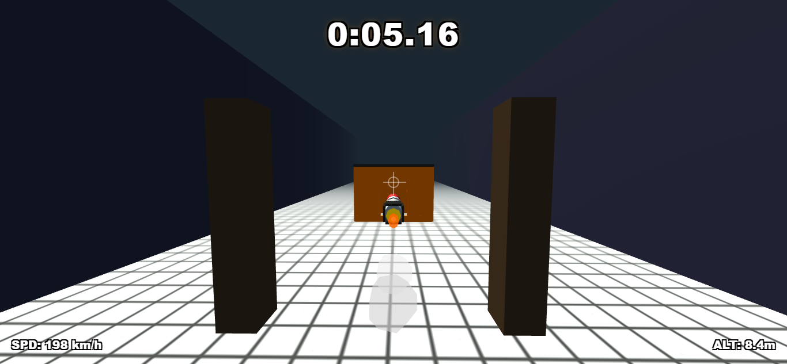
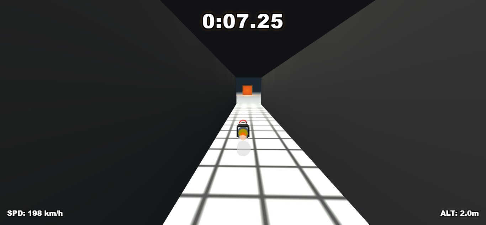
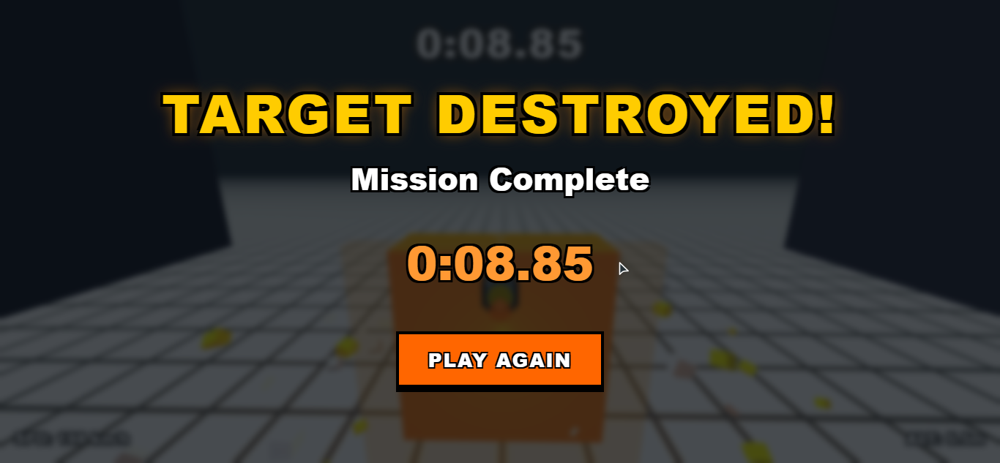

<div align="center">

# 🚀 Missile Mayhem

### A Fast-Paced 3D Guided Missile Arcade Game Built with Three.js

[](https://afnan-nex.github.io/Missile-Mayhem/game.html)
[](https://developer.mozilla.org/docs/Web/JavaScript)
[](https://threejs.org/)
[](https://developer.mozilla.org/docs/Web/HTML)
[](https://developer.mozilla.org/docs/Web/CSS)

**Guide a high-speed missile through an obstacle course, avoid hazards, and destroy the final target.**

### 🎮 **[Play Missile Mayhem Online](https://afnan-nex.github.io/Missile-Mayhem/game.html)**

</div>

---

# 📸 Screenshots

| Gameplay | Obstacle Course |
|----------|-----------------|
|  |  |

| Tunnel | Victory |
|---------|----------|
|  |  |

---

# ✨ Features

<table>
<tr>
<td width="50%">

### 🎯 Gameplay
- Guided missile controls
- Smooth arcade flight
- Mouse & keyboard support
- Boost system
- Countdown launch
- Dynamic chase camera

</td>

<td width="50%">

### 🌍 Environment
- Low-poly graphics
- Procedural obstacle course
- Buildings
- Pillar canyon
- Tunnel section
- Final target objective

</td>
</tr>

<tr>
<td>

### 💥 Effects
- Missile exhaust
- Smoke trail
- Explosion particles
- Dynamic lighting
- Camera smoothing

</td>

<td>

### ⚙ Technical
- Pure HTML
- Vanilla JavaScript
- Three.js
- No build tools
- Single-file project

</td>
</tr>
</table>

---

# 🎮 Live Demo

<div align="center">

## ▶ Play Now

### https://afnan-nex.github.io/Missile-Mayhem/game.html

</div>

---

# 🎮 Controls

| Control | Action |
|----------|--------|
| 🖱 Mouse | Steer Missile |
| W / S | Pitch Up / Down |
| A / D | Turn Left / Right |
| Arrow Keys | Alternative Flight Controls |
| Left Shift | Boost |
| ESC | Release Mouse |

---

# 🎯 Mission

Your objective is simple:

- 🚀 Launch the missile
- 🏛 Navigate the obstacle course
- 🏠 Fly through the building opening
- 🚇 Pass through the tunnel
- 🎯 Destroy the target
- 💥 Avoid crashing

---

# 🛠 Built With

| Technology | Purpose |
|------------|----------|
| HTML5 | Structure |
| CSS3 | Styling |
| JavaScript (ES6+) | Game Logic |
| Three.js | 3D Rendering |
| WebGL | Graphics |

---

# 📁 Project Structure

```text
Missile-Mayhem
│
├── game.html
├── README.md
└── screenshots
    ├── gameplay.png
    ├── course.png
    ├── tunnel.png
    └── victory.png
```

---

# 🚀 Run Locally

Clone the repository:

```bash
git clone https://github.com/Afnan-Nex/Missile-Mayhem.git
```

Go to the project:

```bash
cd Missile-Mayhem
```

Open:

```text
game.html
```

---

# 📈 Future Improvements

- Multiple levels
- Leaderboard
- Sound effects
- Background music
- Mobile support
- Difficulty selection
- More obstacle types
- Checkpoints
- Power-ups
- Better visual effects

---

# 🤝 Contributing

Contributions are welcome.

1. Fork the repository
2. Create a feature branch

```bash
git checkout -b feature/new-feature
```

3. Commit your changes

```bash
git commit -m "Add new feature"
```

4. Push the branch

```bash
git push origin feature/new-feature
```

5. Open a Pull Request

---

# ⭐ Support

If you enjoyed this project, consider giving it a **⭐ Star** on GitHub.

It helps the project reach more people!

---

# 📄 License

This project is licensed under the **MIT License**.

---

<div align="center">

## 🚀 Missile Mayhem

**Built with ❤️ by Afnan Nex**

### 🎮 Play Now

https://afnan-nex.github.io/Missile-Mayhem/game.html

</div>